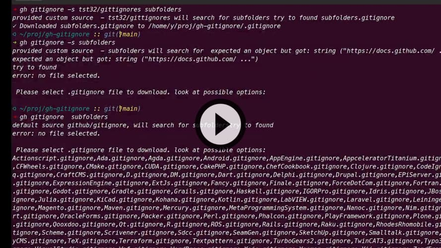

# gh-gitignore


[](https://user-images.githubusercontent.com/23115742/138448932-3d1d97a3-c763-4a16-89ed-31bc052b1cf8.mp4 "using screencast")

  GITHUB-CLI EXTENSION **gitignore**
  Allow you to download to `pwd` a gitignore template from web.
  You can use your own custom source  invoke with ```-s```  option, 
  without option the default repo [github/gitignore](https://github.com/github/gitignore) will be used as template source.


## Prerequsites 
bash script depends on:
  -  ```gh ``` [github cli version >=2](https://cli.github.com/) 
  -  ```jq ``` [command-line tool jq](https://stedolan.github.io/jq/)
  -  ```curl```[command-line tool curl](https://curl.se/download.html) 


## Usage

  - ```bash gh extension install tst32/gh-gitignore```
  - ```gh gitignore -h ``` show usage info
  - ```gh gitignore node ``` download template and save it as .gitignore from https://github.com/github/gitignore/node.gitignore
  - ```gh gitignore -s mygitacc/myrepo myownfile ``` download template and save it as .gitignore from https://github.com/mygitacc/myrepo/myownfile  
